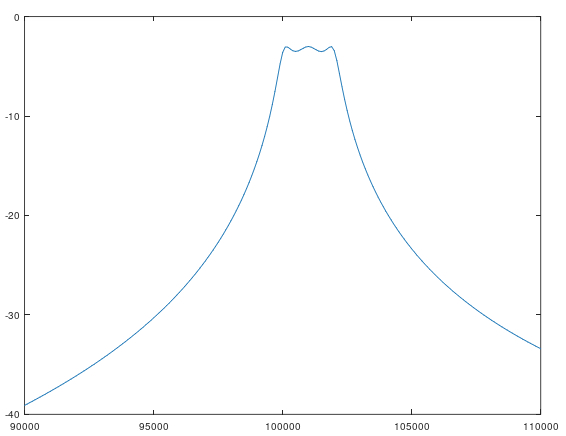

# ep4m
Octave functions for analog filters design.

# examples:

## 1) A three-poles bandpass 100-102kHz filter mesh, 1500 Ohm input and outut impedance

Design the ```topology``` and compute element ```values```:

```octave:1> [topology, values] = efiltermesh(3, 100000, 102000, 1500, 1)```

Print the design (with element values rounded to their nearest E6 series values):

```octave:2> eprintladder(l, eround(e, 6))```
```

         C1       |
 |-------||-------+
        100nF     |
         L1       |
 |-----(_(_(_)----+
        22uH      |
             C2   |
                 ===
            1.5nF |
         C3       |
 |-------||-------+
        100nF     |
         L2       |
 |-----(_(_(_)----+
        22uH      |
             C4   |
                 ===
            1.5nF |
         L3       |
 |-----(_(_(_)----+
        22uH      |
         C5       |
 |-------||-------+
        100nF     |
```

Analyze the frequency response of this quadripole in the range 90-110kHz with 100Hz step, when excitating it with a source of 1500 Ohm (connected in series to the top of the topology) and loading it with 1500 Ohm (connected in shunt to the bottom of the topology):

```octave:3> frequencies = 90000:100:110000```

```octave:4> [attenuations, phaseshifts] = efreqanalyze(topology, values, frequencies, 1500, 1500)```

Plot the computed attenuation per frequency on the logarithmic scale [dB]:

```octave:5> elogplot(frequencies, attenuations)```



## 2) A 5-pole Chebyshev Low-Pass Filter with cut off frequency 20 MHz of 50 Ohm input and 1500 Ohm output impedance

```octave:1> [t1, v1] = eproto2butt(5, false)```

```octave:2> [t2, v2] = escalefilter(t1, v1, 1500, NaN, 20e+6)```

```octave:3> [t3, v3] = eimpmatchtapc(t2, v2, 50, 1500)```

```octave:4> [topology, values] = eterminate(t3, v3)```

```octave:5> eprintladder(topology, eround(values, 12))```

```
                  o
                  |
         C1       |
 |-------||-------+
        18pF      |
             C2   |
                 ===
            3.8pF |
                  |
                 (_
            L1   (_
           18uH  (_
                  |
         C3       |
 |-------||-------+
        10pF      |
                  |
                 (_
            L2   (_
           18uH  (_
                  |
         C4       |
 |-------||-------+
        3.2pF     |
                  |
                  o
```

## 3) Crystall ladder bandpass filter design - 4-pole, 2.5kHz bandwith @ 6MHz, Chebyshev characteristic

Get a crystal oscillator equivalent, based on its characteristic frequencies measured with a network analyzer (here, an example 6MHz crystall oscillator):

```octave:1> [xtaltop, xtalvals] = ecrystal(5.99756e+6, 6.00964e+6, 6.00377e+6, 4.7e-12, 100);```

Generate filter network with its values and characteristic impedance:

```octave:2> [tt, vv, rr] = eladdercheb(4, 2500, xtalvals);```

Print the network (round capacitor values to the nearest E12 series):

```octave:3> eprintladder(tt, eround(vv, 12, tt))```

```
             C1   |             
                 ===            
            68pF  |             
         XTAL1   -|-            
         6MHz    [_]            
                 -|-            
         C2       |             
 |-------||-------+             
        68pF      |             
         XTAL2   -|-            
         6MHz    [_]            
                 -|-            
         C3       |             
 |-------||-------+             
        68pF      |             
         XTAL3   -|-            
         6MHz    [_]            
                 -|-            
         C4       |             
 |-------||-------+             
        68pF      |             
         XTAL4   -|-            
         6MHz    [_]            
                 -|-            
             C5   |             
                 ===            
            68pF  |             
```
